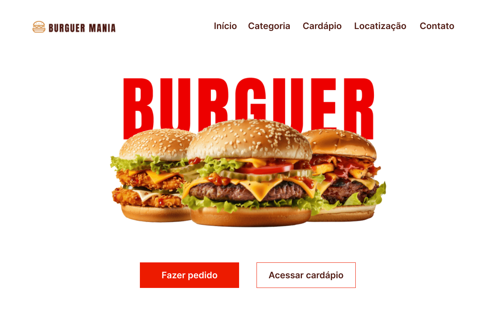
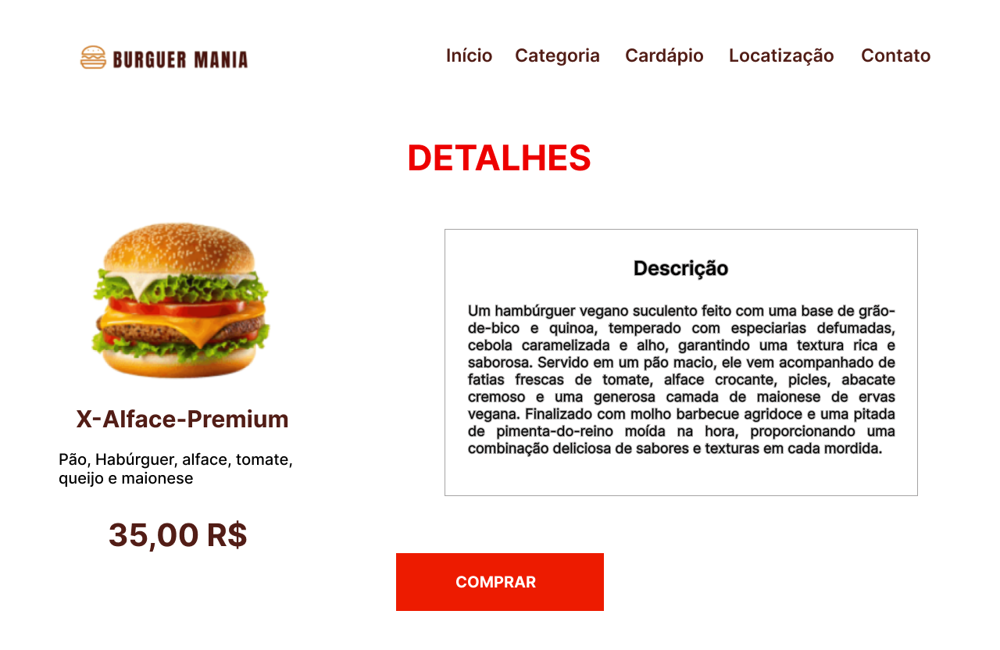

# Burger Mania **(Front-end)**

## 💻 Projeto

Desenvolvimento do **front-end** da uma aplicação web de uma Hamburgueria (Burguer Mania) utilizando o framework Angular e seguindo o design que pode ser encontrado no <a href="https://www.figma.com/design/qO2d4NzMoneeNcpweqgo69/Burguer-Mania?m=auto&t=EqnFTGwCaDdirqYE-6" target="_blank" rel="noopener noreferrer">Figma</a>.
  
O projeto é totalmente responsivo e intuitivo, além de ser componentizado para garantir a reutilização de telas.
  
O projeto do **back-end** pode ser encontrado neste outro
<a href="https://github.com/luiscarloscamara/hamburgueria-back" target="_blank" rel="noopener noreferrer">repositório GitHub</a>.
  

  <a href="#-projeto">Projeto</a>&nbsp;&nbsp;&nbsp;|&nbsp;&nbsp;&nbsp;
  <a href="#-estrutura de navegação">Navegação</a>&nbsp;&nbsp;&nbsp;|&nbsp;&nbsp;&nbsp;
  <a href="#-executar projeto">Executar</a>&nbsp;&nbsp;&nbsp;|&nbsp;&nbsp;&nbsp;
  <a href="#-tecnologias utilizadas">Tecnologias</a>&nbsp;&nbsp;&nbsp;|&nbsp;&nbsp;&nbsp;
  <a href="#-licença">Licença</a>

  
  

## 🔗 Estrutura de Navegação

### **1. Página de Pedidos**
- Ao clicar em **"Pedido"**, o usuário é direcionado para a **tela de pedidos**.

### **2. Página de Cardápio**
- Ao clicar em **"Cardápio"**, o usuário acessa a **tela com as categorias de hambúrguer**.
- Ao selecionar uma **categoria**, o usuário é redirecionado para uma **página com os hambúrgueres disponíveis** dentro desta categoria.

## ⏳ Executar Projeto

 1. Clonar o repositório
 2. Abrir em uma IDE
 3. Executar o comando `npm install`
 4. Executar o comando `npm start` ***em outro terminal***
 5. A aplicação será executada em uma janela do seu navegador padrão

## 🚀 Tecnologias utilizadas

- HTML
- CSS
- Typescript
- Node
- Angular
- <a href="https://ngxpert.github.io/hot-toast/" target="_blank">Angular Hot Toast</a>
- <a href="https://material.angular.io/" target="_blank">Angular Material</a>

## 📝 Licença

Esse projeto está sob a licença MIT.  
